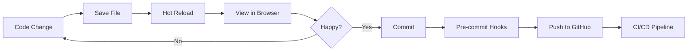

---
📚 [Home](./README.md) | 🤝 [Contributing](./CONTRIBUTING.md) | 📖 [Architecture](./docs/ARCHITECTURE.md)
---

# Docker Setup Guide for ARCG

## 🐳 Quick Start with Docker

### Prerequisites
- Docker Desktop installed ([Download here](https://www.docker.com/products/docker-desktop))
- Git
- 8GB+ RAM recommended

### 1. First Time Setup
```bash
# Clone the repository
git clone https://github.com/allxdamnxday/arcg.git
cd arcg

# Copy environment variables
cp .env.docker.example .env.local

# Edit .env.local with your Supabase credentials
# (Get these from your Supabase project dashboard)

# Build and start the application
docker-compose up
```

The application will be available at `http://localhost:3000`

### 2. Daily Development
```bash
# Start the application
make dev
# OR
docker-compose up

# Stop the application
make down
# OR
docker-compose down
```

## 📦 Docker Architecture

### Multi-Stage Build
Our Dockerfile uses multi-stage builds for optimal size and performance:

1. **base** - Alpine Linux with Node.js and system dependencies
2. **deps** - Dependency installation stage
3. **dev** - Development environment with hot reload
4. **builder** - Production build stage
5. **production** - Minimal production image (~200MB)
6. **test** - Test runner environment

### Docker Compose Files

#### `docker-compose.yml` (Development)
- Hot reload enabled
- Volume mounting for code changes
- Port 3000 exposed
- Development environment variables

#### `docker-compose.test.yml` (Testing)
- Runs tests in isolated environment
- Outputs coverage reports
- CI-ready configuration

#### `docker-compose.prod.yml` (Production-like)
- Optimized production build
- Health checks enabled
- Restart policies configured

## 🛠 Common Docker Commands

### Using Make (Recommended)
```bash
make dev        # Start development environment
make build      # Build Docker images
make test       # Run tests in Docker
make logs       # View container logs
make shell      # Access container shell
make clean      # Clean up all Docker resources
make status     # Check container status
```

### Using Docker Compose Directly
```bash
# Development
docker-compose up                # Start in foreground
docker-compose up -d             # Start in background
docker-compose down              # Stop containers
docker-compose logs -f           # Follow logs
docker-compose exec app sh       # Shell access

# Building
docker-compose build             # Build images
docker-compose build --no-cache  # Rebuild from scratch

# Testing
docker-compose -f docker-compose.test.yml up

# Production
docker-compose -f docker-compose.prod.yml up
```

## 🔧 Troubleshooting

### Build Failures

#### Canvas/Cairo Dependencies
If you see errors related to canvas:
```bash
# The Dockerfile already includes these dependencies
# But if issues persist, try:
docker-compose build --no-cache
```

#### Port Already in Use
```bash
# Find what's using port 3000
lsof -i :3000

# Or use a different port in docker-compose.yml
ports:
  - "3001:3000"
```

### Performance Issues

#### Windows/WSL2 Specific
For better performance on Windows:
1. Store code in WSL2 filesystem (not /mnt/c/)
2. Use Docker Desktop with WSL2 backend
3. Allocate sufficient resources in Docker Desktop settings

#### Mac Specific
For better performance on Mac:
1. Use Docker Desktop's VirtioFS
2. Enable "Use Rosetta for x86/amd64 emulation" on Apple Silicon

### Container Won't Start
```bash
# Check logs
docker-compose logs app

# Rebuild image
docker-compose build --no-cache

# Clean everything and start fresh
make clean
make build
make dev
```

## 🔄 Workflow Integration

### Development Workflow


### CI/CD Integration
Every push triggers:
1. **Linting** - Code style checks
2. **Type Checking** - TypeScript validation
3. **Testing** - Automated test suite
4. **Security Scan** - Vulnerability detection
5. **Docker Build** - Image creation
6. **Deployment** - (on main branch)

## 📊 Resource Usage

### Typical Resource Consumption
- **Development**: ~500MB RAM, minimal CPU
- **Building**: ~2GB RAM, high CPU (temporary)
- **Production**: ~200MB RAM, minimal CPU

### Optimizing Performance
```yaml
# In docker-compose.yml, you can limit resources:
services:
  app:
    deploy:
      resources:
        limits:
          cpus: '2'
          memory: 2G
        reservations:
          cpus: '0.5'
          memory: 512M
```

## 🔒 Security Considerations

### Best Practices
1. **Never commit .env files** - Use .env.example as template
2. **Use specific versions** - Pin Node.js and dependency versions
3. **Non-root user** - Production runs as `nextjs` user
4. **Minimal base image** - Alpine Linux reduces attack surface
5. **Layer caching** - Speeds builds without compromising security

### Environment Variables
```bash
# Development (.env.local)
NEXT_PUBLIC_SUPABASE_URL=your-url
NEXT_PUBLIC_SUPABASE_ANON_KEY=your-key

# Production (use secrets management)
# Consider using Docker secrets or environment-specific configs
```

## 🚀 Deployment

### Building for Production
```bash
# Build production image
docker build --target production -t arcg:latest .

# Run production image
docker run -p 3000:3000 --env-file .env.local arcg:latest
```

### Deploying to Cloud

#### GitHub Container Registry
```bash
# Build and tag
docker build --target production -t ghcr.io/allxdamnxday/arcg:latest .

# Push to registry (requires authentication)
docker push ghcr.io/allxdamnxday/arcg:latest
```

#### Docker Hub
```bash
# Tag for Docker Hub
docker tag arcg:latest yourusername/arcg:latest

# Push to Docker Hub
docker push yourusername/arcg:latest
```

## 📈 Monitoring

### Health Checks
The production container includes health checks:
```bash
# Check health status
docker inspect --format='{{json .State.Health}}' arcg-prod
```

### Viewing Logs
```bash
# All logs
docker-compose logs

# Follow logs
docker-compose logs -f

# Last 100 lines
docker-compose logs --tail=100

# Specific service
docker-compose logs app
```

## 🔄 Updating Dependencies

When updating package.json:
```bash
# Stop containers
docker-compose down

# Rebuild with new dependencies
docker-compose build

# Start with new image
docker-compose up
```

## 💡 Pro Tips

### 1. Faster Builds
- Use `.dockerignore` to exclude unnecessary files
- Leverage build cache by ordering Dockerfile commands properly
- Use `--parallel` flag for multi-service builds

### 2. Development Efficiency
- Use `docker-compose up -d` to run in background
- Set up aliases in your shell:
  ```bash
  alias dcu='docker-compose up'
  alias dcd='docker-compose down'
  alias dcl='docker-compose logs -f'
  ```

### 3. Debugging
- Use `docker-compose run app sh` for one-off commands
- Mount additional volumes for debugging tools
- Use Chrome DevTools for Node.js debugging

### 4. Cross-Platform Development
- Same environment on Windows, Mac, and Linux
- No "works on my machine" issues
- Consistent Node.js and dependency versions

## 📚 Additional Resources

- [Docker Documentation](https://docs.docker.com/)
- [Docker Compose Documentation](https://docs.docker.com/compose/)
- [Next.js Docker Example](https://github.com/vercel/next.js/tree/canary/examples/with-docker)
- [Best Practices for Node.js Docker](https://github.com/nodejs/docker-node/blob/main/docs/BestPractices.md)

## 🆘 Getting Help

If you encounter issues:
1. Check the troubleshooting section above
2. Review container logs: `docker-compose logs`
3. Search existing [GitHub Issues](https://github.com/allxdamnxday/arcg/issues)
4. Create a new issue with:
   - Docker Desktop version
   - Operating system
   - Error messages
   - Steps to reproduce

---

**Happy Dockerizing!** 🐳🚀