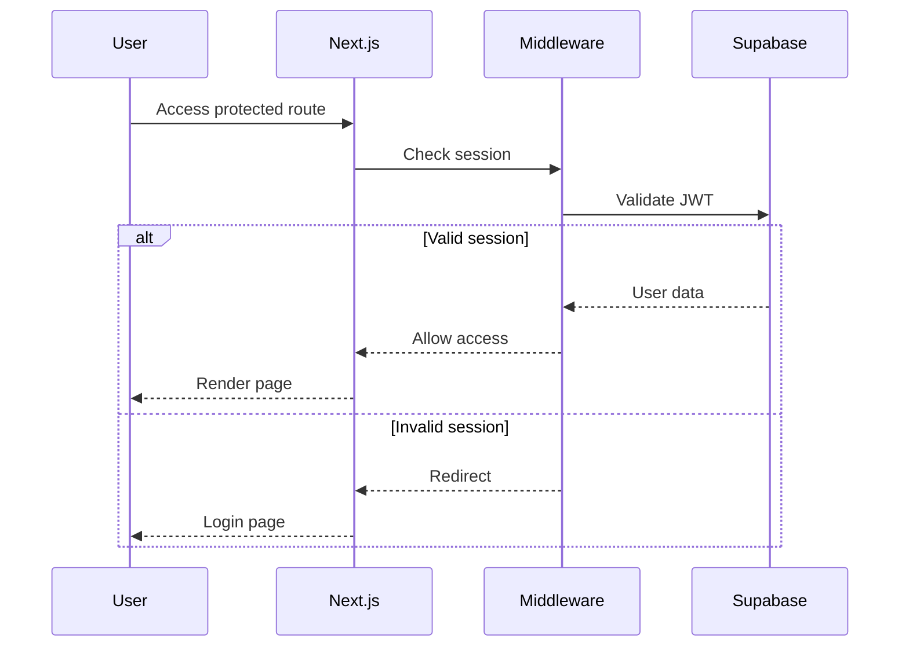

---
📚 [Home](../README.md) | 🐳 [Docker](../README_DOCKER.md) | 🤝 [Contributing](../CONTRIBUTING.md)
---

# System Architecture

Technical architecture and design patterns for the ARCG Change Order Management System.

## 🏗 High-Level Architecture

```
┌─────────────────┐     ┌─────────────────┐     ┌─────────────────┐
│                 │     │                 │     │                 │
│   Next.js App   │────▶│   Supabase      │────▶│   PostgreSQL    │
│   (Frontend)    │     │   (BaaS)        │     │   (Database)    │
│                 │     │                 │     │                 │
└─────────────────┘     └─────────────────┘     └─────────────────┘
        │                       │
        │                       │
        ▼                       ▼
┌─────────────────┐     ┌─────────────────┐
│   Tesseract.js  │     │  Supabase       │
│   (OCR Engine)  │     │  Storage        │
└─────────────────┘     └─────────────────┘
```

## 📁 Project Structure

```
/
├── app/                    # Next.js 14 App Router
│   ├── (auth)/            # Public authentication pages
│   │   ├── login/
│   │   ├── register/
│   │   └── reset-password/
│   ├── (app)/             # Protected application pages
│   │   ├── dashboard/
│   │   ├── projects/
│   │   ├── change-orders/
│   │   └── delay-notices/
│   └── api/               # API routes
│       └── pdf/           # PDF generation endpoint
│
├── components/            # React components
│   ├── ui/               # shadcn/ui base components
│   ├── features/         # Feature-specific components
│   │   ├── change-orders/
│   │   ├── ocr/
│   │   └── projects/
│   └── forms/            # Form components
│
├── lib/                  # Core utilities
│   ├── supabase/        # Database client & queries
│   │   ├── client.ts
│   │   ├── server.ts
│   │   ├── actions.ts
│   │   └── queries/
│   ├── validations/     # Zod schemas
│   ├── pdf/            # PDF templates
│   └── utils.ts        # Helper functions
│
├── types/              # TypeScript definitions
│   └── database.ts     # Generated Supabase types
│
└── middleware.ts       # Auth & route protection
```

## 🎯 Core Design Patterns

### 1. **Server Components by Default**
```typescript
// app/(app)/projects/page.tsx
export default async function ProjectsPage() {
  const projects = await getProjects() // Direct DB call
  return <ProjectsList projects={projects} />
}
```

### 2. **Server Actions for Mutations**
```typescript
// app/(app)/projects/actions.ts
'use server'
export async function createProjectAction(data: FormData) {
  const validated = projectSchema.parse(data)
  await createProject(validated)
  revalidatePath('/projects')
}
```

### 3. **Type-Safe Database Access**
```typescript
// Generated from Supabase schema
import type { Database } from '@/types/database'
type Project = Database['public']['Tables']['projects']['Row']
```

### 4. **Route Groups for Layouts**
- `(auth)` - Unauthenticated layout
- `(app)` - Authenticated layout with navigation
- Middleware enforces authentication boundaries

## 🔐 Authentication Flow



## 💾 Database Schema

### Core Tables
```sql
users               (id, email, full_name, role)
    ↓
projects            (id, name, project_number, client_name)
    ↓
change_orders       (id, project_id, co_number, status, ocr_text)
    ├── change_order_items (id, change_order_id, description, price)
    └── documents          (id, change_order_id, file_url)

delay_notices       (id, project_id, title, incident_date, status)
```

### Key Features
- **UUID primary keys** for all tables
- **RLS (Row Level Security)** policies
- **Triggers** for updated_at timestamps
- **Views** for aggregated data

## 🔌 Supabase MCP Integration

The codebase includes Supabase MCP (Model Context Protocol) server access, providing AI assistants with live database capabilities.

### Live Database Access
AI assistants can:
- Query real-time table schemas and row counts
- Execute SQL queries for debugging and analysis
- Apply migrations directly to the database
- Monitor logs across all services
- Check security and performance advisories

### Current Database State (Live via MCP)
```sql
-- Check current data distribution
SELECT
  'users' as table_name, COUNT(*) as row_count FROM users
UNION ALL
SELECT 'projects', COUNT(*) FROM projects
UNION ALL
SELECT 'change_orders', COUNT(*) FROM change_orders
UNION ALL
SELECT 'delay_notices', COUNT(*) FROM delay_notices;
```

### MCP Tools Available
| Tool | Purpose | Example Usage |
|------|---------|---------------|
| `mcp__supabase__list_tables` | Get schema info with row counts | Check before coding new features |
| `mcp__supabase__execute_sql` | Run SQL queries | Debug data issues, analyze patterns |
| `mcp__supabase__apply_migration` | Apply DDL changes | Add tables, columns, indexes |
| `mcp__supabase__get_logs` | View service logs | Debug errors in api, auth, storage |
| `mcp__supabase__get_advisors` | Security/performance check | Audit RLS policies, find issues |
| `mcp__supabase__generate_typescript_types` | Generate types | Update after schema changes |

### Real Database Schema (from MCP)
The actual production schema includes:
- **users**: 2 records - User profiles with roles (admin/user)
- **projects**: 1 record - Construction projects with full details
- **change_orders**: 33 columns including OCR, labor calculations, approval workflow
- **change_order_items**: Line items with quantity/pricing
- **documents**: File attachments with metadata
- **delay_notices**: 1 record - Delay tracking with status workflow

All tables have:
- UUID primary keys with `uuid_generate_v4()`
- RLS policies requiring authentication
- Automatic `updated_at` triggers
- Proper foreign key relationships

## 🔄 Data Flow Patterns

### Server-Side Rendering (SSR)
```typescript
// Page Component (Server)
async function Page() {
  const data = await fetchData()  // Runs on server
  return <Client data={data} />   // Hydrates on client
}
```

### Client-Side Interactions
```typescript
// Client Component
'use client'
function Form() {
  return (
    <form action={serverAction}>  {/* Server Action */}
      <input name="field" />
      <button>Submit</button>
    </form>
  )
}
```

### Real-time Updates
```typescript
// Supabase Realtime subscription
const channel = supabase
  .channel('changes')
  .on('postgres_changes',
    { event: '*', schema: 'public', table: 'change_orders' },
    (payload) => handleUpdate(payload)
  )
  .subscribe()
```

## 🎨 UI Component Architecture

### Component Hierarchy
```
<Layout>                    // Route group layout
  <Navigation />           // Shared navigation
  <Page>                   // Server component
    <DataTable>           // Client component
      <TableRow />        // Presentation
        <Actions />       // Interactive
    <Form>                // Client component
      <Input />           // Controlled
      <Button />          // Actions
```

### State Management
- **Server state**: Fetched in Server Components
- **Form state**: React Hook Form
- **UI state**: React useState/useReducer
- **URL state**: searchParams for filters/sorting

## 📸 OCR Processing

### Client-Side Architecture
```javascript
// Browser-based processing
Image Upload → Canvas → Tesseract.js → Text Extraction → Form Population
```

### Storage Flow
```
Upload → Supabase Storage (co-images bucket) → Public URL → Database Reference
```

## 📄 PDF Generation

### Server-Side Rendering
```typescript
// API Route handles PDF generation
POST /api/pdf → Fetch data → React PDF render → Stream response
```

### Template Structure
```
Document
  └── Page
      ├── Header (company info)
      ├── Body (change order details)
      ├── LineItems (table)
      └── Footer (signatures)
```

## 🚀 Performance Optimizations

### Build-Time
- **Standalone output** for minimal Docker images
- **Tree shaking** removes unused code
- **Image optimization** with Next.js Image

### Runtime
- **Dynamic imports** for heavy components
```typescript
const OcrUploader = dynamic(() => import('@/components/ocr'), {
  ssr: false
})
```

- **Parallel data fetching**
```typescript
const [projects, users] = await Promise.all([
  getProjects(),
  getUsers()
])
```

- **Streaming SSR** with Suspense boundaries

## 🔒 Security Measures

### Authentication
- JWT tokens managed by Supabase
- HTTP-only cookies for session storage
- Middleware validates all protected routes

### Authorization
- RLS policies at database level
- Server-side validation before mutations
- Type-safe API boundaries

### Data Protection
- Environment variables for secrets
- No sensitive data in client bundles
- Input sanitization with Zod schemas

## 🐳 Container Architecture

### Multi-Stage Docker Build
```
base → deps → dev → builder → production
```

### Layer Optimization
- Dependencies cached separately
- Source code in later layers
- Production image ~200MB

## 📈 Monitoring & Observability

### Error Boundaries
```typescript
// app/(app)/error.tsx
export default function Error({ error, reset }) {
  // Log to monitoring service
  console.error(error)
  return <ErrorUI onReset={reset} />
}
```

### Performance Metrics
- Lighthouse CI in GitHub Actions
- Web Vitals tracking
- Bundle size analysis

## 🔄 CI/CD Pipeline

### GitHub Actions Workflow
```
Push → Lint → Type Check → Test → Build → Deploy
         ↓
    Security Scan
```

### Deployment Strategy
- Docker images tagged with commit SHA
- GitHub Container Registry storage
- Automated rollback on failure

## 📚 Key Technologies

| Layer | Technology | Purpose |
|-------|------------|---------|
| Frontend | Next.js 14 | React framework with SSR |
| Styling | Tailwind + shadcn | Utility CSS + components |
| Language | TypeScript | Type safety |
| Database | PostgreSQL | Relational data |
| Auth | Supabase Auth | User management |
| Storage | Supabase Storage | File uploads |
| OCR | Tesseract.js | Text extraction |
| PDF | React PDF | Document generation |
| Container | Docker | Deployment consistency |
| CI/CD | GitHub Actions | Automation |

## 🎯 Design Principles

1. **Simplicity First** - Minimal dependencies, clear patterns
2. **Type Safety** - TypeScript throughout, validated schemas
3. **Performance** - SSR by default, optimize when needed
4. **Security** - Defense in depth, principle of least privilege
5. **Developer Experience** - Hot reload, clear errors, good tooling

---

For implementation details, see [CLAUDE.md](../CLAUDE.md). For setup instructions, see [Manual Setup](./MANUAL_SETUP.md) or [Docker Guide](../README_DOCKER.md).